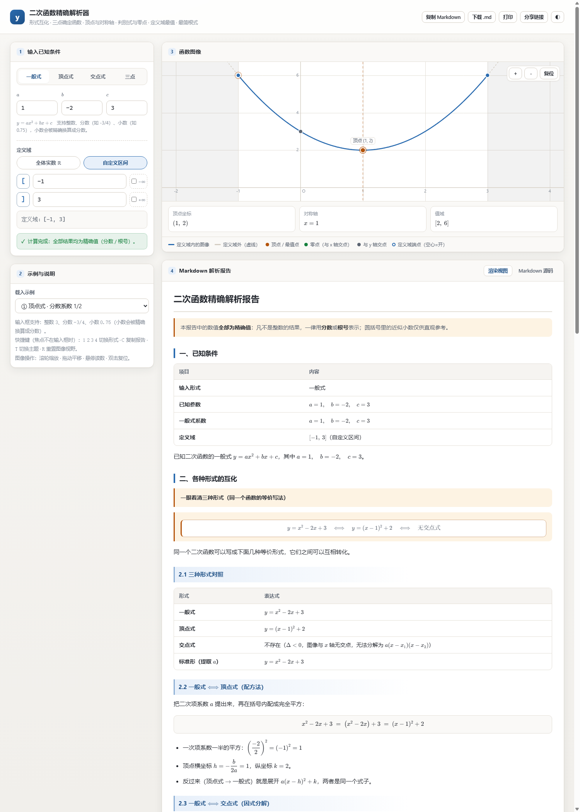
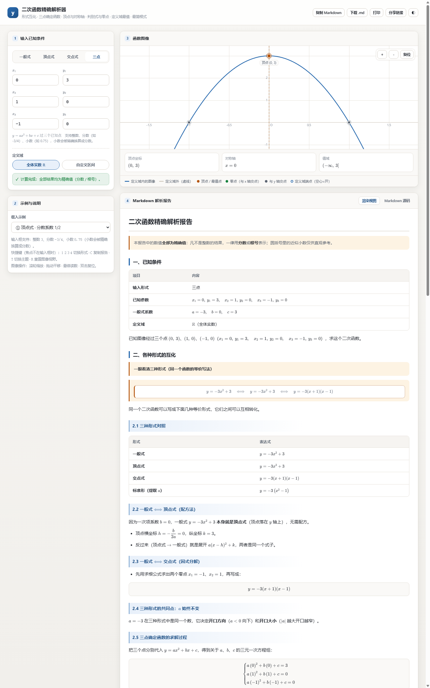
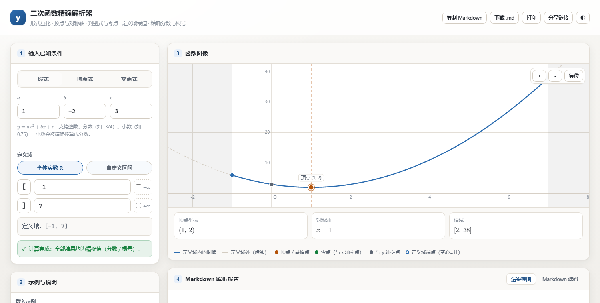

# 二次函数精确解析器 · quadratic-exact-lab

输入**一般式 / 顶点式 / 交点式**中的任意一种，自动完成三种形式的互化、顶点坐标与对称轴、
判别式与零点、单调性、图像特征，并可在**自定义定义域**上求出最大值、最小值与值域；
也可以直接给出**三个已知点**，反求经过它们的二次函数。
**所有结果都以精确值呈现：凡不是整数的数值，一律用分数或根号表示**，绝不依赖浮点近似。





---

## 一、核心特性

| 能力 | 说明 |
| --- | --- |
| 三种形式互化 | 一般式 `y = ax² + bx + c`、顶点式 `y = a(x−h)² + k`、交点式 `y = a(x−x₁)(x−x₂)` 任意一种输入，自动推导另外两种 |
| **三点确定函数** | 输入三个已知点 `(x₁,y₁) (x₂,y₂) (x₃,y₃)`，用克莱姆法则精确解三元一次方程组，得到唯一的二次函数；三点共线、或有两点横坐标相同都会给出明确提示 |
| 顶点与对称轴 | 用配方法给出顶点坐标与对称轴，并展示配方推导过程 |
| 判别式与零点 | Δ = b² − 4ac，区分「两个不等实根 / 二重根 / 无实根」，零点精确化简（如 `2 ± √3`、`1 ± √6⁄2`） |
| 韦达定理 | 自动给出 x₁ + x₂ 与 x₁x₂ |
| 定义域分析 | 支持全体实数、闭区间、开区间、半开半闭、单侧无界区间（如 `[3, +∞)`、`(−∞, 0]`） |
| 最值与值域 | 分类讨论对称轴与定义域的位置关系，给出最大值/最小值**及取到该值的点**；开区间端点取不到时会明确说明「只是上/下确界」 |
| 精确排版 | 有理数与二次根式全程精确运算：`1/2` 显示为分数，`√8` 自动化简为 `2√2`，`√Δ/(2a)` 自动约分 |
| **最简根式保证** | 输出的每一个根式都是最简根式——根号内不含平方因子，如 `√280 = 2√70`、`√32 = 4√2`；判别式非完全平方时，报告会单独列出化简过程 |
| **互化醒目展示** | 「二、各种形式的互化」拆成 2.1 三种形式对照表 / 2.2 一般式⟺顶点式（配方法）/ 2.3 一般式⟺交点式（因式分解）/ 2.4 共同点 / 2.5 三点求解过程，标题带强调边框、行间公式带卡片底纹，一眼就能找到 |
| Markdown 报告 | 生成结构完整、表格对齐、公式规范的 Markdown；可复制、可下载 `.md`、可打印 |
| 图像可视化 | Canvas 绘制抛物线，标注顶点、零点、定义域端点（空心=开、实心=闭）、对称轴、最值点；定义域外的部分用灰色虚线表示 |
| 离线可用 | 数学排版使用**随包携带的 KaTeX**，无需联网，双击 `index.html` 即可使用 |

### 额外功能

- **链接分享**：输入被编码进 URL，复制链接即可完整还原当前条件。
- **深色 / 浅色主题**：一键切换，图表配色同步跟随。
- **图像交互**：滚轮缩放、拖动平移、悬停读数（自动把浮点还原成简单分数）、双击复位。
- **键盘快捷键**：`1` `2` `3` `4` 切换输入形式（一般式 / 顶点式 / 交点式 / 三点），`C` 复制报告，`T` 切换主题，`R` 重置视野。
- **容错输入**：支持小数（`0.75` → `3/4`，精确换算，不是近似）、分数（`-3/4`）、全角字符（`１`、`－２`）。
- **结果自检**：报告最后一节会代回原式验证顶点、零点与判别式。
- **打印排版**：`@media print` 规则会自动隐藏输入区与工具栏，只输出报告正文。

---

## 二、快速开始

直接双击 `index.html` 即可（无需服务器、无需联网、无需构建）。

如果希望用本地服务器打开（某些浏览器对 `file://` 的剪贴板有限制）：

```powershell
# 任选其一
npx --yes serve .
python -m http.server 8080
```

### 输入约定

| 形式 | 需要填写 | 例子 |
| --- | --- | --- |
| 一般式 | `a`、`b`、`c` | `a=1, b=-2, c=3` → `y = x² − 2x + 3` |
| 顶点式 | `a`、`h`、`k` | `a=1/2, h=3, k=4` → `y = ½(x−3)² + 4` |
| 交点式 | `a`、`x₁`、`x₂` | `a=1/3, x₁=-1, x₂=5` → `y = ⅓(x+1)(x−5)` |
| 三点 | 三个点的坐标 `x₁, y₁, x₂, y₂, x₃, y₃` | `(0,3) (1,0) (-1,0)` → `y = −3x² + 3` |

数值允许写成整数、分数或小数：`3`、`-3/4`、`0.75`、`１`（全角）。

---

## 三、目录结构

```
quadratic-exact-lab/
├─ index.html          页面骨架
├─ styles.css          版式与主题（含打印样式）
├─ engine.js           精确计算引擎：Frac（有理数）、Surd（二次根式）、Quad、定义域分析、TeX 排版
├─ report.js           把计算结果组织成完整 Markdown 报告（纯函数）
├─ markdown.js         自研 Markdown 渲染器（公式受保护，交给 KaTeX）
├─ ui.js               界面逻辑：输入、事件、URL 状态、Canvas 绘图
├─ vendor/katex/       随包携带的 KaTeX（离线数学排版）
├─ docs/               预览截图
└─ tests/              自测脚本（Node.js 运行）
```

---

## 四、精确性是怎么保证的

1. **有理数用 `BigInt` 表示**：`Frac` 以「大整数分子 / 大整数分母」存储并自动约分，
   因此 `1/3 + 1/6` 得到的是精确的 `1/2`，而不是 `0.4999999999999999`。
2. **二次根式用 `a + b√d` 表示**：`Surd` 把 `√8` 化简为 `2√2`、`√(1/2)` 化简为 `√2⁄2`，
   并且**判号完全精确**——判断 `2√2` 与 `3` 的大小不需要任何浮点运算。
   化简是自动且彻底的：输出的**每一个根式都是最简根式**（根号内不含平方因子），
   必要时报告还会给出化简过程，例如 `√280 = 2√70`、`√1000 = 10√10`。
3. **求根公式全程在根式域内运算**：`x = (−b ± √Δ)/(2a)` 先算 `√Δ/(2a)` 再与 `−b/(2a)` 合并，
   所以 `2x² − 4x − 1` 直接得到 `1 ± √6⁄2`，而不是先算成小数再猜分数。
4. **浮点只用于两处**：画图坐标、以及报告中明确标注为「近似值」的对照列。
5. **报告里的每一条公式都会被 KaTeX 编译校验**：测试脚本会抽出 Markdown 中全部数学片段，
   逐条确认能被 KaTeX 正确排版，任何畸形公式都会让测试失败。

---

## 五、自测

需要 Node.js（仅测试需要，使用程序本身不需要）：

```powershell
node tests/engine.test.js      # 精确引擎 39 项：有理数、根式、互化、三点、零点、定义域分析、排版
node tests/report.test.js      # 报告生成 71 项：结构完整性、互化小节、最简根式扫描、KaTeX 逐条排版校验
node tests/edge.test.js        # 边界用例 14 项：退化区间、开区间、负分数、极大系数、三点、全角输入
node tests/markdown.test.js    # Markdown 渲染器：标题/列表/表格/引用/公式
node tests/dom-check.js        # 页面与脚本的 id 引用一致性
```

也可以一次跑完：

```powershell
node tests/run-all.js
```

### 测试覆盖的典型场景

| 场景 | 期望结果 |
| --- | --- |
| `y = x² − 2x + 3` 在 `[−1, 3]` | 最小值 `2`（x=1），最大值 `6`（x=−1 与 x=3 同时取得），值域 `[2, 6]` |
| `y = x² − 2x + 3` 在 `(1, 4]` | 顶点落在开端点上 → 最小值 `2` **取不到**，值域 `(2, 11]` |
| `y = x² − 2x + 3` 在 `[3, +∞)` | 单调递增，最小值 `6`，无最大值，值域 `[6, +∞)` |
| `y = −x² + 4x − 1` 在 `[0, 5]` | 最大值 `3`（x=2），最小值 `−6`（x=5） |
| `y = ½x² − 3x + 5` 在 `[−1, 7]` | 最小值 `1/2`，最大值 `17/2`（两端同时取得） |
| `y = x² − 4x + 1` | 零点 `2 ± √3`，顶点 `(2, −3)` |
| `y = 2x² − 4x − 1` | 零点 `1 ± √6⁄2`（自动约分） |
| `y = x² + 1` | Δ < 0，明确说明**不存在**实数零点与交点式 |
| `y = x² − 70` | Δ = 280 → 报告中给出 `√280 = 2√70`，零点 `±√70` |
| 三点 `(0, 3) (1, 0) (−1, 0)` | 解得 `y = −3x² + 3`，顶点 `(0, 3)`，零点 `±1` |
| 三点 `(0, −2) (1, −1) (2, 2)` | 解得 `y = x² − 2`，零点 `±√2`（根式已化为最简） |
| 三点共线 `(0,0) (1,1) (2,2)` | 明确报错：三个点无法确定二次函数 |

---

## 六、界面说明



- **左栏**：选择输入形式（一般式 / 顶点式 / 交点式 / 三点）→ 填写系数或三个点的坐标 → 选择定义域。定义域端点的方括号按钮可直接点击切换开 / 闭，
  勾选 `−∞` / `+∞` 可把该侧设为无界。
- **右上**：函数图像，圆点标注零点与 y 轴交点，橙色环标注顶点与最值点，**蓝色圆环标注「三点」模式下输入的已知点**，
  空心圆表示开区间端点，灰色虚线表示定义域外的图像走势。
- **右下**：Markdown 报告，可在「渲染视图」与「Markdown 源码」之间切换。
- 修改任意输入会实时重算（有 130ms 防抖），输入非法时在输入框下方给出明确提示。

---

## 七、技术说明

- **零运行时依赖**：`engine.js` / `report.js` / `markdown.js` 均为手写原生实现，
  不依赖任何第三方库；只有 `vendor/katex` 是用于数学排版的独立静态资源。
- **`report.js` 是纯函数**：`build(input)` 返回 `{ ok, markdown, data }`，不触碰 DOM，
  因此可以直接在 Node 中单元测试（测试就是这么做的）。
- **`markdown.js` 的公式保护机制**：先按 `$$…$$` 与 `$…$` 把公式抽成占位符，
  再做 HTML 转义与行内标记解析，最后还原为 KaTeX 输出——因此公式内容永远不会被误伤，
  正文也不会被公式里的特殊字符破坏。
- **不错版的实现要点**：网格列使用 `minmax(0, 1fr)` 防止内容撑破容器；
  表格与行间公式各自独立横向滚动；会变化的区域预留固定高度，避免重算时页面跳动。
- **KaTeX 授权**：`vendor/katex/LICENSE`（MIT）。

---

## 八、已知边界

- `a = 0` 会被明确拒绝（那时是一次函数，不属于本工具范围）。
- 根号内的平方因子提取上限为 `2 000 000`，用于防止超大整数时的性能问题；
  正常教学与考试范围的数值远低于此上限。
- 近似值默认保留 4 位小数并去掉末尾多余的 0。
- 「三点」模式下，三个点共线、或有两点横坐标相同而纵坐标不同，都无法唯一确定二次函数，程序会直接报错。
