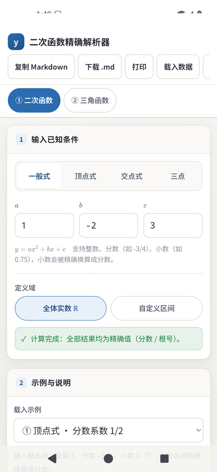
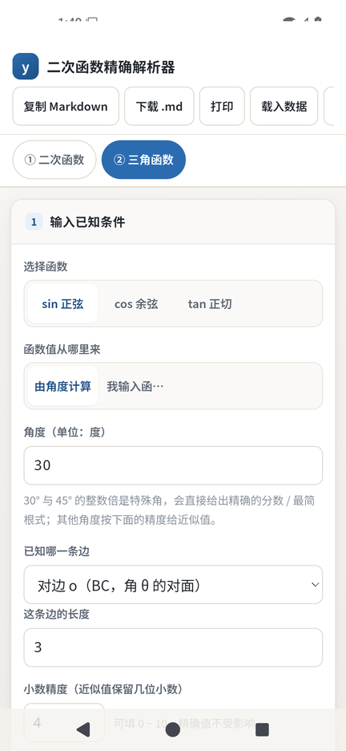
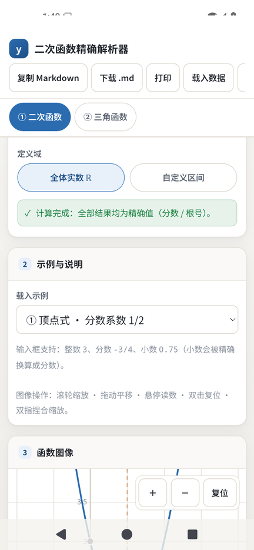

# Android 版说明 · quadratic-exact-lab

本文是**公开文档**，只讲怎么构建、怎么验证、以及套壳时做了哪些取舍。
本机的工具链路径、磁盘占用等环境细节不在本文里。

---

## 一、Android 版是什么

**是一个 WebView 壳**，不是重写。

`android/` 里只有一个 `MainActivity`（约 300 行 Java）和一个 `WebView`，
页面、计算引擎、报告生成、KaTeX 排版**全部复用仓库根目录那一套 JS**，
一个字符都没改。

- 计算逻辑：`engine.js` / `report.js` / `trig.js` / `trig-report.js` —— **原样**
- 界面逻辑：`ui.js` / `trig-ui.js` / `styles.css` / `index.html` —— **原样**
- 数学排版：`vendor/katex/` —— 随包携带，**完全离线**（MIT）

资源通过 `file:///android_asset/index.html` 加载，整个应用**不申请任何权限**
（连 `INTERNET` 都没有），因为没有一行代码需要联网。

| 项 | 值 |
| --- | --- |
| 应用名 | 二次函数精确解析器 |
| 包名 | `cn.piaochong.quadraticexactlab` |
| `compileSdk` / `targetSdk` | 35（Android 15） |
| `minSdk` | 24（Android 7.0） |
| 版本 | `versionName 1.4.1` / `versionCode 10401` |
| 依赖 | **无**（不用 AndroidX / AppCompat，纯系统框架） |
| 权限 | **无** |
| APK 体积 | 正式包 689 KB / 调试包 751 KB |
| 签名 | APK Signature Scheme v2，RSA 4096，自签名（见第六节） |





---

## 二、构建

### 2.1 环境要求

| 组件 | 版本 |
| --- | --- |
| JDK | 17 |
| Gradle | 8.9（仓库自带 wrapper，也会自动下载） |
| Android SDK Platform | android-35 |
| Android Build-Tools | 35.0.0 |

Gradle 分发包走的是**腾讯云镜像**（`android/gradle/wrapper/gradle-wrapper.properties`），
官方 `services.gradle.org` 在国内经常下到一半断掉。

### 2.2 三步构建

```bash
# 1) 生成 www/：把「运行时需要的文件」挑出来放进 assets 根目录
node scripts/make-www.js

# 2) 生成图标（需要 Python 3 + Pillow），源图是 desktop/icon.png
py scripts/make-android-icons.py

# 3) 构建 APK
cd android
./gradlew assembleDebug      # 调试包：开 WebView 远程调试，端到端测试要用它
./gradlew assembleRelease    # 正式包：需要签名配置（见第六节），没有配置就出未签名包
```

产物：

| 变体 | 路径 |
| --- | --- |
| debug | `android/app/build/outputs/apk/debug/quadratic-exact-lab-1.4.1-debug.apk` |
| release | `android/app/build/outputs/apk/release/quadratic-exact-lab-1.4.1-release.apk` |

Windows 上直接跑 `gradlew.bat`；`android/local.properties` 里写好 `sdk.dir=...`，
或者设好 `ANDROID_HOME` 环境变量。

### 2.3 为什么要单独的 `www/`

`desktop/`、`tests/`、`node_modules/` 都是**开发期**的东西，不能进 APK。
`scripts/make-www.js` 里硬编码了运行时清单：

```
index.html  styles.css  engine.js  report.js  markdown.js  help.js  ui.js
trig.js  trig-report.js  trig-ui.js  vendor/**
```

（`help.js` 是应用内「使用说明」的正文，由 `scripts/make-help.js` 从 `docs/USAGE.md` 生成；
它是**运行时文件**，必须打进 APK，所以列在清单里、也没有进 `.gitignore`。）

脚本跑完会做一次**兜底体检**：如果 `www/` 里出现 `desktop/`、`tests/`、`node_modules/`
之类的目录，直接报错退出。最终 `www/` 约 0.77 MB / 32 个文件，其中 0.5 MB 是 KaTeX 字体。

`www/` 与 `android/local.properties`、`android/build/` 一样都在 `.gitignore` 里 —— 它们是生成物。

---

## 三、壳这一层做了什么

`MainActivity` 只做四件事，其余全交给网页：

| 能力 | 实现 |
| --- | --- |
| 加载页面 | `WebView.loadUrl("file:///android_asset/index.html")` |
| 导出文件 | `window.QuadAndroid.saveFile(name, mime, base64)` → API 29+ 走 `MediaStore` 写进「下载」目录（**不需要存储权限**）；更低版本落到应用自己的外部目录 |
| 复制 | `window.QuadAndroid.copy(text)` → 系统剪贴板 |
| 打印 | `window.QuadAndroid.printPage()` → 系统打印框架（用户可选「另存为 PDF」） |
| 载入 JSON | 实现 `onShowFileChooser`，让「载入数据」按钮能弹系统文件选择器 |

### 3.1 网页侧怎么感知

`ui.js` / `trig-ui.js` 里各有一段：

```js
var Android = window.QuadAndroid || null;   // 网页版 / 桌面版为 null
```

有 `QuadAndroid` 时就把浏览器语义的按钮换成原生语义：

- 「下载 .md」→ 保存到「下载」目录
- 「打印」→ 系统打印（可另存为 PDF）
- 「分享链接」→ **改成「导出图像」**。APK 里的链接是 `file:///android_asset/...`，
  复制出去没有任何意义，所以这个按钮在 Android 上换了语义
- 额外多一个「载入数据」按钮（浏览器版是靠桌面版才有的）
- `<html>` 上加 `is-android` 标记

### 3.2 中文文件名与 Base64

原生桥只收 **Base64**：中文文件名和 UTF-8 正文如果直接当字符串丢过 JSCore 边界，
很容易被截断或转成乱码（JSCore 用的是 UTF-16，控制字符会被吞）。
网页侧统一走 `utf8ToBase64()`（`TextEncoder` + 分块 `btoa`），
原生侧 `Base64.decode` 拿回字节，**导出的 Markdown 与页面里的内容逐字符一致**——
这条已经被自动化测试断言死在 `tests/android.test.js` 里。

### 3.3 安全上的取舍

- **不申请 `INTERNET`**：页面完全离线，加了权限只是白送攻击面。
- **不申请存储权限**：API 29+ 用 `MediaStore`，API 24~28 用应用自己的外部目录。
- **`android:usesCleartextTraffic` 没开**（默认 false），本来也用不到网络。
- **`release` 关掉 R8**：`@JavascriptInterface` 标注的方法会被 R8 当成「无人调用」删掉，
  删掉后 `window.QuadAndroid.saveFile(...)` 会**静默失效**（不报错、不落盘，极难查）。
  `app/proguard-rules.pro` 里已经写好 keep 规则，以后想开 R8 直接改 `minifyEnabled true` 即可。
- **WebView 远程调试只对 debug 包主动开**：

  ```java
  if ((getApplicationInfo().flags & ApplicationInfo.FLAG_DEBUGGABLE) != 0) {
      WebView.setWebContentsDebuggingEnabled(true);
  }
  ```

  但这里有个**实测出来的反直觉结论**：在 `ro.debuggable=1` 的 **userdebug / eng 镜像**上
  （模拟器就是），平台自己会把 WebView 调试打开，**应用压不住**——
  即使显式调用 `WebView.setWebContentsDebuggingEnabled(false)`，
  主进程照样会挂出 `@webview_devtools_remote_<pid>` 这个 abstract socket。
  实测过程：把正式包装到 userdebug 模拟器上，`dumpsys package` 的 flags 里**没有** `DEBUGGABLE`
  （确认它确实不是调试包），但 socket 依然在；再把调试包改成无条件传 `false` 重新编译，socket **还在**。

  结论：**「不暴露调试端口」是正式（user）镜像的属性，不是这几行代码保证的**。
  `tests/android.test.js` 因此按镜像类型分别判断（见 5.1），不会把模拟器上的 socket 误判成应用的问题，
  也不会拿它当「正式包很安全」的证据。

---

## 四、移动端适配（与网页版共用同一份代码）

移动端适配**没有分叉**，就是 `styles.css` 里两个媒体查询 + `ui.js` 里一段触摸处理，
所以桌面版、网页版、Android 版三者的布局来源是同一份。

### 4.1 修复：滚动后切换条被页头盖住（v1.3.0 的回归）

原来 `.app-header`（`z-index: 20`）和 `.mode-bar`（`z-index: 19`）**各自** `position: sticky; top: 0`，
滚动后页头把整条切换条盖住 —— 桌面 1440px 宽时重叠 59px，390px 宽的手机上重叠 **105px**，
切换条既看不见也点不到。

改成**一个 sticky 容器**：

```html
<div class="top-dock" id="top-dock">
  <header class="app-header">…</header>
  <nav class="mode-bar" id="mode-bar">…</nav>
</div>
```

```css
.top-dock { position: sticky; top: 0; z-index: 30; background: var(--card); box-shadow: 0 1px 0 var(--line); }
.app-header { /* 不再 sticky */ }
.mode-bar   { /* 不再 sticky */ }
```

回归测试断言在 4 种窗口宽度 + 1 台真机上都成立（见第五节）。

### 4.2 `@media (max-width: 720px)`

- **安全区**：`.top-dock` 加 `env(safe-area-inset-top/left/right)`，`body` 加左右安全区，
  toast 上抬到底部安全区之上（配合 `viewport-fit=cover`）
- **页头瘦身**：隐藏副标题、按钮组整行落下并允许横向滚动
  → 手机竖屏页头从 **209 px 压到 103 px**（含状态栏安全区后整个吸顶区 211 px）
- **触控目标 ≥ 44 px**：`.btn` / `.segmented button` / `.view-tabs button` / `.radio-pill` /
  `.bracket-btn` / `.inf-toggle` / `.plot-toolbar` 按钮全部抬到 44 px
- **输入框字号 ≥ 16 px**：低于 16 px 时移动端浏览器聚焦会自动放大整页
- `.md-table-wrap { contain: paint }` —— 嵌套横向滚动容器会让 Chrome 把它的内容宽度
  算进根元素 `scrollWidth`，在 320 px 下凭空多出 5 px 的横向滚动

### 4.3 `@media (max-width: 480px)`

- 切换条改用短标签（`① 二次函数` / `② 三角函数`），两个按钮一屏放下，**不用横向滚动**
- 面板标题栏换行，视图切换按钮整行落下（320 px 下会挤出横向溢出）

### 4.4 双指捏合缩放

`ui.js` 的 `Plot.init` 里加了 `touchstart` / `touchmove` / `touchend` / `touchcancel`：
两指时按「上一帧距离 / 当前帧距离」缩放，中点跟随双指中心；
单指仍然走原来的 pointer 事件拖动平移，互不打架
（`pointermove` 里 `if (pinch) return;`）。

`Plot` 另外暴露了 `getView()`，测试用它断言捏合**真的改变了视野范围**，不是只触发了一次事件。

### 4.5 触屏提示

快捷键说明对触屏用户没有意义，用 `@media (pointer: coarse)` 换掉：

```css
.touch-hint { display: none; }
@media (pointer: coarse) {
  .kbd-hint { display: none; }
  .touch-hint { display: inline; }   /* 双指捏合缩放 */
}
```

按 `pointer: coarse` 而不是按宽度判断 —— 窄窗口的桌面浏览器仍然是鼠标，仍然需要那份快捷键说明。

---

## 五、验证方式

**没有靠截图猜。** 三层，全部是真实 DOM / 真实 WebView：

| 层 | 文件 | 内容 |
| --- | --- | --- |
| 布局回归 | `desktop/smoke-mobile.js` + `tests/desktop.test.js` | Electron 里一个窗口依次切到 390×844 / 320×640 / 768×1024 / 1440×900，量吸顶重叠、触控目标、输入框字号、横向溢出、`elementFromPoint` 命中、合成双指事件 |
| 真机端到端 | `tests/android.test.js` | adb + CDP（`Runtime.evaluate`）在真实 Android WebView 里跑断言 |
| 一键全跑 | `node tests/run-all.js` | 9 个套件 |

### 5.1 真机端到端做了什么

`tests/android.test.js` 会：装 APK → 启动 → `adb forward` 到 WebView 的 devtools socket →
用 CDP 在页面里跑断言。**没有设备时打印 `skip` 并以 0 退出**，不影响纯网页版套件。

它验证的是「套壳之后**才**可能出现的问题」：

- 装上去的包与要验的变体一致（`release` 必须是**不可调试**的，`dumpsys package` 的 flags 里没有 `DEBUGGABLE`）
- assets 是否真的加载到了（`file:///android_asset/index.html`、离线 KaTeX 字体有没有生效）
- 原生桥 `window.QuadAndroid` 是否挂上、`isAndroid()` / `platform()` / `versionName()` 是否正确
- 真实手机 viewport 下：吸顶重叠 = 0、触控目标 ≥ 44 px、输入框 ≥ 16 px、横向溢出 = 0
- 两个工作区都能切换，三张 Canvas 都**真的画了东西**（抽样统计不透明像素）
- 导出**真的落盘**：调用 `saveFile` 后 `ls /sdcard/Download/`，再把文件 `adb pull` 回来，
  断言内容逐字符与页面里的一致（能抓到 Base64 往返截断、UTF-8 乱码）
- `dumpsys package` 确认**没有申请任何权限**
- `logcat -b crash` 确认**没有崩溃**

调试端口那一条按镜像类型分开判断：正式镜像上出现端口直接判失败；
userdebug 镜像上出现端口只**提示**（平台行为），并在没有端口时降级成「adb 层检查」——
窗口起没起来、页面有没有真的渲染（`screencap` 的原始像素格式直接统计墨色占比，不依赖任何解码库）、
`logcat` 里有没有 `ERR_FILE_NOT_FOUND`。

实测环境：Android 15（API 35）x86_64 模拟器，1080×2340 @ 440dpi（视口 393×851 css px，dpr 2.75）。
**调试包与签名过的正式包各 16 项断言，全部通过**；
页头 103 px、切换条 59 px、吸顶重叠 0，正式包导出的 Markdown 与页面内容逐字符一致。

### 5.2 怎么自己跑

```bash
# 起一个模拟器（或插一台开了 USB 调试的手机）
$ANDROID_HOME/emulator/emulator -avd <你的 AVD> &

# 构建 + 安装 + 验证
node scripts/make-www.js
cd android && ./gradlew assembleDebug && cd ..
node tests/android.test.js

# 想验签名过的正式包（没有调试端口时会自动降级成 adb 层检查）
ANDROID_APK=$PWD/android/app/build/outputs/apk/release/quadratic-exact-lab-1.4.1-release.apk \
  node tests/android.test.js
```

测试脚本会自动处理「设备上装的是另一个签名的同包名版本」——
先卸载再装（应用本身不存任何用户数据，卸载无副作用）。

---

## 六、签名

发布用的正式包是**自签名**的（APK Signature Scheme v2，RSA 4096，有效期 30 年）。
`app/build.gradle` 检测到 `android/keystore.properties` 就自动接上 release 签名：

```properties
# android/keystore.properties —— 本机文件，已在 .gitignore 里
storeFile=../quadratic-exact-lab.jks
storePassword=…
keyAlias=quadlab
keyPassword=…
```

密钥库 `quadratic-exact-lab.jks` 放在仓库根目录，同样被 `.gitignore` 挡住（`*.jks`）。
没有这个文件时 `assembleRelease` 会产出**未签名**的 APK（`apksigner verify` 报 `DOES NOT VERIFY`），
只能本地检查，装不上设备。

`minSdk 24` 下 v2 签名是够用的，所以产物里没有 v1（JAR）签名 —— `apksigner verify` 会显示
`Verified using v2 scheme: true` / `v1 scheme: false`，这是正常的，不是缺陷。

> ⚠️ **这个密钥同时是应用的「更新身份」**：以后每个包都必须用同一个密钥签名，
> 否则已安装的用户升不上去，只能卸载重装。请把 `.jks` 和 `keystore.properties` 一起备份。
> 换了密钥（或换了开发者）就相当于换了一个应用。

---

## 七、已知边界

- **三角函数的两张画布不支持捏合缩放**。它们本身是按真实比例自动缩放到刚好放下的，
  缩放后反而会出现「画布外」的空白；二次函数画布需要缩放是因为它画的是连续曲线。
- **横屏没有专门优化**。手机横屏（如 851×393）会落到 720px 断点以外的桌面布局，
  能用但没有为扁屏重新排过版。
- **`www/` 是生成物**，改完根目录的 JS/CSS 必须重跑 `node scripts/make-www.js` 再构建 APK，
  否则 APK 里还是旧代码。
- **不做 PWA / TWA**。国内应用商店基本不收 TWA，而这个应用的价值全在离线计算上，
  WebView 壳已经把这件事做完了。
